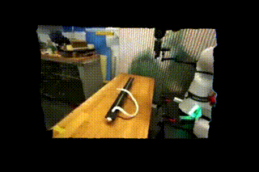

<p align="center">
  
  <h1 align="center">Kinema4D: Kinematic 4D World Modeling for Spatiotemporal Embodied Simulation</h1>

<div align="center">
<br>
<a href="https://arxiv.org/abs/2603.16669" target="_blank">
    
</a>
<a href="https://mutianxu.github.io/Kinema4D-project-page/" target="_blank">
    
</a>
<a href="https://huggingface.co/datasets/Minoday/Robo4D-200k" target="_blank">
  
</a>
<a href="https://huggingface.co/Minoday/Kinema4D" target="_blank">
  
</a>
<br>

***[Mutian Xu<sup>1</sup>](https://mutianxu.github.io/), [Tianbao Zhang<sup>2</sup>](https://mutianxu.github.io/), <br>[Tianqi Liu<sup>1</sup>](https://tqtqliu.github.io/), [Zhaoxi Chen<sup>1</sup>](https://frozenburning.github.io/), [Xiaoguang Han<sup>2</sup>](https://gaplab.cuhk.edu.cn/), [Ziwei Liu<sup>1†</sup>](https://liuziwei7.github.io/)***

<sup>1</sup>S-Lab, Nanyang Technological University  <sup>2</sup>SSE, CUHKSZ 

</div>

<p align="center">
  <a href="">
    
  </a>
</p>


We propose *Kinema4D*, a new *action-conditioned **4D** generative robotic simulator*. Given an initial world image with a robot at a canonical setup space, and an action sequence, our method generates *future robot-world interactions* in 4D space. A sample result is shown below:

<div align="center">

</div>

## 📢 News
Official PyTorch implementation and checkpoints are all released. (Apr.9, 2026) 🔥🔥🔥

## 🚧 TODO List
- [x] Robo4D-200k Dataset
- [x] Training and Inference Scripts
- [x] Visualization Scripts
- [x] Data Preprocessing Scripts
- [x] Model Checkpoints

## 💪 Get Started

### Environment Setup
We use anaconda or miniconda to manage the python environment:
```bash
conda create -n "kinema4d" python=3.10 -y
conda activate kinema4d
pip3 install torch torchvision --index-url https://download.pytorch.org/whl/cu121
pip install -r requirements.txt

# git lfs and rerun
conda install -c conda-forge git-lfs
conda install -c conda-forge rerun-sdk
```

### Data Preparation: Robo4D-200k

#### Download Data
Please download our **Robo4D-200k** dataset from [here](https://huggingface.co/datasets/Minoday/Robo4D-200k), and upzip all the files into a single dataset folder. 

The data should be organized in the following structure:

```
data_dir/
├── first_frames/     <n>.png   ← first-frame images
├── videos/           <n>.mp4   ← original RGB videos
├── pointmap/         <n>.mp4   ← point-map videos           
├── mask_videos/      <n>.mp4   ← robot-only RGB videos
├── mask_pointmap/    <n>.mp4   ← robot-only point-map videos
├── train_shuffled.txt          ← training episode video ID
└── train_img_shuffled.txt      ← training episode first_frame ID
```

#### Robot-occupancy mask preparation
Change the `path_to_robo4d200k` at [here](https://github.com/mutianxu/Kinema4D/blob/main/save_mask.py#L10) and [here](https://github.com/mutianxu/Kinema4D/blob/main/save_mask.py#L60), to your previously saved dataset folder path.

Run the command below to preprocess it:
```
python save_mask.py
```

#### VAE latents preparation
Encode raw videos, point maps, and their masked variants into VAE latents, and extract CLIP image embeddings from the first frame. For example:

*Single machine, 4 GPUs:*
 
```bash
python encode_latents.py \
    --data-dir    /path/to/robo4d200k \
    --out         /path/to/robo4d200k \
    --model-path  ./pretrained/Wan2.1-I2V-14B-480P-Diffusers \
    --num-gpus 4 \
    --max-frames 49 \
    --resolution-h 480 --resolution-w 720 \
    --skip-existing
```
 
*Multi-machine (e.g. 4 machines, 8 GPUs each):*
 
```bash
python encode_latents.py \
    --num-machines 4 --machine-id 0 --num-gpus 8 \
    --data-dir /path/to/robo4d200k \
    --out      /path/to/robo4d200k \
    --model-path ./pretrained/Wan2.1-I2V-14B-480P-Diffusers \
    --skip-existing
```


### Output Structure

```
data_dir/
├── video_latents/
│   ├── xxx.safetensors
├── pointmap_latents/
│   ├── xxx.pt
├── mask_video_latents/
│   ├── xxx.safetensors
└── mask_pointmap_latents/
    ├── xxx.pt
```

After finish processing, the total data volume is ~**7TB**. Please leave sufficient disk space. 

### Data pre-processing *from scratch (Optional)*
In addition, we provide the *full* data pre-processing code in the [data_proc_full](https://github.com/mutianxu/Kinema4D/blob/main/data_proc_full) folder. It includes our whole data pre-processing pipeline on real-world demonstration datasets, associated with the corresponding instructions.

## 🚀 Usage

### Pretrained Model
Our model is developed on top of [Wan2.1 I2V 14B](https://huggingface.co/Wan-AI/Wan2.1-I2V-14B-480P-Diffusers) and [4DNeX](https://huggingface.co/FrozenBurning/4DNex-Lora), please download all the pretrained models from Hugging Face and place it in the `pretrained` directory as following structure:
```
Kinema4D/
└── pretrained/
    └── Wan2.1-I2V-14B-480P-Diffusers/
        ├── model_index.json
        ├── scheduler/
        ├── unet/
        ├── vae/
        ├── text_encoder/
        ├── tokenizer/
        └── ...
    └── 4dnex-lora/
        ├── learnable_domain_embeddings.pt
        ├── pytorch_lora_weights.safetensors
        └── ...
```

### Launch Training
To launch training, we assume all data, mask array, VAE latents are fully prepared. Change the data_root to the Robot4D-200k folder path in `scripts/finetune.sh`, and run the following command:
```bash
bash scripts/finetune.sh
```

**Model-type choice**: We provide our model conditioned on [robot RGB+pointmap](https://github.com/mutianxu/Kinema4D/blob/main/core/finetune/models/wan_i2v/demb_samerope_trainer_act.py) and [only robot pointmap](https://github.com/mutianxu/Kinema4D/blob/main/core/finetune/models/wan_i2v/demb_samerope_trainer_act_pmcond.py). 

Generally, to get stable results on our pseudo-annotated robot data (e.g., DROID, Bridge, RT-1), you may choose the condition of robot RGB+pointmap by setting `--model_name wan-i2v-demb-samerope-act` in `finetune.sh` (by default).

As for real-world deployment, to get robust results, we recommend using the condition of robot pointmap to mitigate the projection errors by setting `--model_name wan-i2v-demb-samerope-act-pmcond` in `finetune.sh`.


**Cross-machine training**: Take 4 machines + 8gpus/machine as an example (we have provided the corresponding config `gpu_1,2,3,4.yaml` in `configs_acc` folder). In `finetune.sh`: 
- Set the `--main_process_ip` to the actual ip address of your master machine for all machines
- Set the `--machine_rank` to the actual rank of each machine (e.g., 0 for the master machine; 1 or 2 or 3 for other 3 machines)
- Set the `--num_processes` to 32 for all machines
- Set the `--num_machines` to 4 for all machines
- Leave all the other configs unchanged and respectively running the previous command on each machine


🌟**NOTE**: At the first-time training, a cache folder for saving text embedding will be created.
Although the text embedding is not used in our model, we leave the code here to better align with the general video generation model codebase for future explorations on how to better use text beyond action-conditioned simulation, such as text-conditioned task planning.
After saving all the text embedding successfully, please uncomment the for loop at [here](https://github.com/mutianxu/Kinema4D/blob/main/core/finetune/trainer.py#L198) to skip this step in the future training.

### Convert Zero Checkpoint to FP32
After training, convert the zero checkpoint to fp32 checkpoint for inference. For example, to save the checkpoint of the 5600-th iteration:
```bash
python scripts/zero_to_fp32.py ./training/kinema4d/checkpoint-5600 ./training/kinema4d/5600-out --safe_serialization

python get_emb_from_ckpt_all.py ./training/kinema4d/checkpoint-5600
```

### Inference
You may download our Kinema4D checkpoints from [here](https://huggingface.co/Minoday/Kinema4D) and place it in the `./training` directory:
```bash
mkdir training
cd training
mkdir kinema4d_ckpt
cd kinema4d_ckpt
hf download Minoday/Kinema4D kinema4d_ckpt --local-dir . --repo-type model
cd ../..
export KINEMA4D_CKPT_PATH=./training/kinema4d_ckpt
```

After setup the environment and trained models, you can run the following command to generate full 4D robot-world interactions from a single image, the output video and point map will be saved in the `OUTPUT_DIR` directory. Run the following command:
```bash
export OUTPUT_DIR=./results
python inference.py --data_path /path/to/robo4d200k/ --video /path/to/robo4d200k/val_sel.txt --out $OUTPUT_DIR --sft_path ./pretrained/Wan2.1-I2V-14B-480P-Diffusers/transformer  --type i2vwbw-demb-samerope-act --mode xyzrgb --lora_path $KINEMA4D_CKPT_PATH --lora_rank 64
```

If you use the condition of only robot pointmap, simply revise the previous hf dowload command into `hf download Minoday/Kinema4D kinema4d_pmcond_ckpt --local-dir .`, and change `demb_samerope_trainer_act` into `demb_samerope_trainer_act_pmcond` at [here](https://github.com/mutianxu/Kinema4D/blob/main/core/inference/wan.py#L132) and [here](https://github.com/mutianxu/Kinema4D/blob/main/core/inference/wan.py#L176), then run the same command above.

### Sample test
You may download several samples for testing our model at our [dataset repo](https://huggingface.co/datasets/Minoday/Robo4D-200k) - `sample_test`:
```bash
hf download Minoday/Robo4D-200k sample_test --local-dir [YOUR LOCAL DIR to save sample_test] --repo-type dataset
```
Then run the following command:
```bash
export OUTPUT_DIR=./results
python inference.py --data_path /path/to/sample_test --video /path/to/sample_test/val_sample.txt --out $OUTPUT_DIR --sft_path ./pretrained/Wan2.1-I2V-14B-480P-Diffusers/transformer  --type i2vwbw-demb-samerope-act --mode xyzrgb --lora_path $KINEMA4D_CKPT_PATH --lora_rank 64
```

### Visualization
To visualize the generated 4D robot-world interactions, you need to convert the results to `.npz` format first by running the following command:

```
python convert_mp4_pairs_to_viser_npz.py --rgb_dir ./results/videos --xyz_dir ./results/pointmap --npz_out_dir ./results/npz_out
```

Then, use the viser-viewer to visualize an `.npz` file by running:
```
python viser_viewer.py --input ./results/npz_out/xxx.npz
```

### Real-world deployment
Assume you have gained the real-world robot pointmap/RGB, simply refer to VAE latents preparation to get the robot pointmap/RGB VAE latents, and run the inference code to get the final results.

## Contact
If you have further question, please contact [Mutian XU](mailto:mutian.xu@ntu.edu.sg).

## 📄 Citation

```bibtex
@article{xu2026kinema4d,
title={Kinema4D: Kinematic4D World Modeling for Spatiotemporal Embodied Simulation},
author={Xu, Mutian and Zhang, Tianbao and Liu, Tianqi and Chen, Zhaoxi and Han, Xiaoguang and Liu, Ziwei},
journal={arXiv preprint arXiv:2603.16669},
year={2026}
}
```
